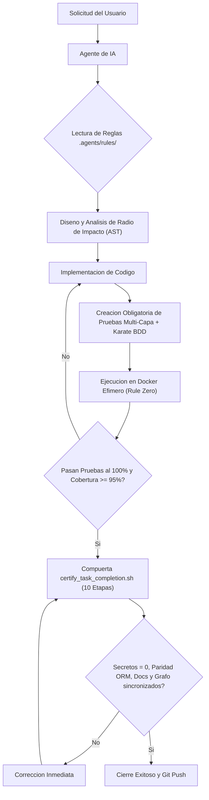

# 🤖 Arquitectura y Gobernanza de Agentes de Inteligencia Artificial (Nivel 11X)

> **PROPÓSITO:**  
> Este documento establece el estándar para orquestar, restringir y guiar a agentes de IA autónomos (Google Antigravity, Anthropic Claude Code / Claude Desktop, Hermes Agent de Nous Research, Cursor, Windsurf) para que operen como ingenieros Staff de QA y DevOps sin alucinaciones, sin deuda técnica y con total reproducibilidad.

---

## 1. De la Asistencia Pasiva a la Gobernanza Activa

Tratar a los modelos de lenguaje (LLMs) como simples autocompletadores de código genera código espagueti, mocks desconectados de la base de datos y regresiones silenciosas. En el estándar **11X**, el agente de IA es un operador autónomo sujeto a compuertas mecánicas estrictas:


```mermaid
flowchart TD
    A["Solicitud del Usuario"] --> B["Agente de IA"]
    B --> C{"Lectura de Reglas .agents/rules/"}
    C --> D["Diseno y Analisis de Radio de Impacto (AST)"]
    D --> E["Implementacion de Codigo"]
    E --> F["Creacion Obligatoria de Pruebas Multi-Capa + Karate BDD"]
    F --> G["Ejecucion en Docker Efimero (Rule Zero)"]
    G --> H{"Pasan Pruebas al 100% y Cobertura >= 95%?"}
    H -->|"No"| E
    H -->|"Si"| I["Compuerta certify_task_completion.sh (10 Etapas)"]
    I --> J{"Secretos = 0, Paridad ORM, Docs y Grafo sincronizados?"}
    J -->|"No"| K["Correccion Inmediata"]
    K --> I
    J -->|"Si"| L["Cierre Exitoso y Git Push"]
```

---

## 2. La Estructura de Gobernanza `.agents/`

El directorio `.agents/` en la raíz de los proyectos representa el estándar moderno y portable de gobernanza:

1. **`rules/` (Reglas de Cumplimiento Innegociable):**
   - Directivas redactadas en Markdown que los agentes ingieren como System Prompts o reglas de proyecto.
   - Ejemplos: `mandatory_qa_pyramid_and_doc_sync.md`, `secure_development_and_testing_guidelines.md`, `anti_regression_and_side_effects_guardrail.md`.
2. **`skills/` (Habilidades y Playbooks de Dominio):**
   - Paquetes de instrucciones especializadas para flujos complejos (ej. `qa-11x-docker-certifier`, `docker-trivy-keydb-hardening`).
3. **`scripts/` (Compuertas Automatizadas en CLI):**
   - Scripts deterministas en Python y Bash que auditan el código antes de permitir el commit (`certify_task_completion.sh`, `verify_alembic_orm_parity.py`, `verify_zero_orphan_vue_components.py`).

---

## 3. Estrategia Lingüística, *Progressive Disclosure* y Economía Cognitiva de Tokens (~35% en Reglas y 65%–85% en Ejecución)

Un dilema común al gobernar agentes de IA es el idioma y el consumo de ventana de contexto. En este ecosistema implementamos una **estrategia bimodal deliberada** combinada con *3-Tier Progressive Disclosure* y un protocolo cognitivo de reducción de tokens:

### ¿Por qué las reglas internas están en inglés técnico de alta densidad?

1. **Economía de Tokens BPE (Byte-Pair Encoding):**
   - Los tokenizadores de frontera (Tiktoken de OpenAI, Claude Tokenizer, Gemini Tokenizer) fragmentan las palabras en español en un número significativamente mayor de tokens que el inglés técnico conciso.
   - Redactar `.agents/rules/` y `.agents/skills/` en inglés técnico ahorra aproximadamente un **35% de la ventana de contexto**, permitiendo que quepa más código fuente, esquemas de bases de datos y trazas de pruebas.
2. **Arquitectura de Revelación Progresiva en 3 Niveles (*3-Tier Progressive Disclosure*):**
   - **Nivel 1 (Siempre cargado):** Bloque conector compacto en `AGENTS.md` / `GEMINI.md` (~25 líneas).
   - **Nivel 2 (Bajo demanda al activar la Skill):** `SKILL.md` deduplicado que referencia reglas en lugar de repetir párrafos.
   - **Nivel 3 (Inyección Quirúrgica Just-In-Time):** Archivos en `.agents/rules/*.md` y `references/*.md` leídos únicamente cuando la tarea toca ese dominio específico.
3. **3 Vías Proporcionales de Ejecución (`DOCS_ONLY`, `MICRO_CHANGE`, `FULL_11X`):**
   - Evita ejecutar el pipeline pesado de 11 pasos en micro-fixes quirúrgicos (`<= 3` archivos, 0 cambios de API/ORM y `blast_radius == LOW` con `< 5` llamadores), reduciendo entre un **70% y 85%** el gasto de tokens en parches pequeños sin sacrificar cobertura (`>= 95%`) ni la compuerta final `certify_task_completion.sh`.
4. **Protocolo de Economía Cognitiva de Tokens (*High-IQ Token Economy* — 6 Estrategias en `qa-11x-architect`):**
   - (1) *AST/Grep-First, Windowed-Read-Second* (`StartLine`/`EndLine` de 40–80 líneas; prohibido leer archivos completos `> 150` líneas a ciegas), (2) *Zero Redundant Re-Read Invariant*, (3) *Parallel Tool Call Batching*, (4) *Subagent Context Isolation & Model Cascading* (retorno máximo de `<= 20` líneas con punteros `archivo:línea`), (5) *Pass-Quiet & RTK Terminal Output Filtering*, y (6) *Surgical Diff Edits & Compact Scratchpad Budget* (`ACTIVE_TASK.md <= 40` líneas + `/compact`).
5. **Mayor Adherencia Lógica e Instruccional:**
   - Los modelos de frontera exhiben una adherencia más rigurosa a las directivas de seguridad y lógica cuando las restricciones están expresadas en la terminología canónica de la ingeniería de software (RFCs, **DISA ASD STIG V6R5**, **OWASP Developer Guide v4.2 / ASVS / WSTG / API Top 10 / OSHP / CycloneDX SBOM**, FIPS 140-3, ISO).

### Garantía de Salida en Español para Humanos (`OUTPUT LANGUAGE CONSTRAINT`)

Para asegurar una experiencia óptima para el equipo humano, todas las reglas incluyen la cláusula inviolable:
```markdown
> **OUTPUT LANGUAGE CONSTRAINT:**
> Always communicate with the user, provide status updates, explain reasoning,
> and write commit messages / user-facing documentation in Spanish.
```
Toda la documentación (`docs/`, `CHANGELOG.md`, `README.md`, `TESTING.md`) y las respuestas al usuario se mantienen estrictamente en español.

---

## 4. Compatibilidad Multi-Agente y Ecosistema MCP

Esta arquitectura funciona de forma nativa e idéntica en las principales herramientas de desarrollo asistido y agentes autónomos:

| Herramienta / Agente | Mecanismo de Ingestión MCP | Integración de Skills, Scripts y Conector | Archivo de Entrada / Configuración |
| :--- | :--- | :--- | :--- |
| **Google Antigravity** | `mcp_config.json` (`npx -y @sinfallas/mcp-qa-11x@latest`) | `npx -y @sinfallas/mcp-qa-11x@latest install-skill --target antigravity --init-agents --include-scripts` | `.agents/` + `AGENTS.md` |
| **Anthropic Claude Code / Desktop** | `claude_desktop_config.json` (`stdio`) | `npx -y @sinfallas/mcp-qa-11x@latest install-skill --target claude --init-agents --include-scripts` | `AGENTS.md` + `.agents/skills/` |
| **Hermes Agent (Nous Research)** | `config.yaml` (`mcp_servers`) | `npx -y @sinfallas/mcp-qa-11x@latest install-skill --target hermes --init-agents --include-scripts` | `AI_MASTER_PROMPT.md` + `Makefile` |
| **Cursor / Windsurf** | `.cursor/mcp.json` (`mcpServers`) | `npx -y @sinfallas/mcp-qa-11x@latest install-skill --target cursor --init-agents --include-scripts` | `AGENTS.md` y `.agents/rules/` |

---

## 5. El Servidor MCP Canónico (`@sinfallas/mcp-qa-11x`) y la Adopción Zero-Clone

Para evitar que los agentes deban clonar gigabytes de repositorios o saturar su ventana de contexto con cientos de archivos, el ecosistema se distribuye como servidor MCP oficial bajo el estándar de Anthropic / Linux Foundation (ver también [`docs/specs/13_SPEC_OPTIMIZACION_EXTREMA_TOKENS_MCP_3_VIAS_Y_PROGRESSIVE_DISCLOSURE.md`](specs/13_SPEC_OPTIMIZACION_EXTREMA_TOKENS_MCP_3_VIAS_Y_PROGRESSIVE_DISCLOSURE.md)):

1. **9 Recursos Dinámicos (`blueprint://*`):**
   - `blueprint://manifest`: Índice criptográfico con hashes SHA-256 de todos los stacks y archivos comunes.
   - `blueprint://core/philosophy`: Filosofía 11X y prompt maestro (`AI_MASTER_PROMPT.md`).
   - `blueprint://security/disa-owasp-22`: Síntesis técnica de los 22 patrones DISA ASD STIG V6R5 y OWASP v4.2.
   - `blueprint://{stack}/readme`: Especificación del stack solicitado (`fastapi`, `vue3`, `node-backend`, `python`, `react-frontend`, `bash-scripts`, `php`).
   - `blueprint://ui/refactoring-ui/{topic}`: Directivas tácticas visuales y WCAG 2.1 AA (`hierarchy`, `spacing-layout`, `typography`, `color`, `depth-shadows`, `images-icons`, `forms-tables-dashboards`, `dark-mode`, `polish-checklists`).
   - `blueprint://core/active-task-template`: Plantilla de seguimiento resiliente para agentes.
   - `blueprint://core/cleanup-script`: Script de saneamiento universal sin `sudo`.
   - `blueprint://core/roadmap-validator`: Validador de consistencia de hoja de ruta.
   - `blueprint://core/docs-invariants-validator`: Validador de presupuesto cognitivo (`SKILL.md < 20 KB`, `ACTIVE_TASK <= 40` líneas) y paridad Dual-Consumer (`verify_docs_invariants.py`).

2. **12 Herramientas de Ejecución (`Tools`):**
   - `inspect_project_config`: Detección automática del stack, linters, disponibilidad de pruebas en navegador real (`BrowserTestingReadiness`) y estado de actualización `update_available` (comparación SemVer con caché TTL 24h *fail-open* contra `.qa-11x-version`).
   - `fetch_blueprint_bundle`: Descarga quirúrgica de plantillas con validación de hashes SHA-256 (soporta modo índice `include_content: false` en Hito 14).
   - `bootstrap_or_merge_11x`: Fusión no destructiva inyectando configuraciones QA en proyectos existentes.
   - `inspect_ast_blast_radius`: Auditoría AST previa de radio de impacto para cambios en funciones o símbolos y elegibilidad para `MICRO_CHANGE`.
   - `clean_workspace_11x`: Purga segura de cachés y artefactos sin necesidad de privilegios `sudo`.
   - `audit_security_stig_owasp`: Auditoría estática de reglas DISA/OWASP (`SEC-01` a `SEC-16`), invariantes de calidad (`QA-KARATE-IDEMP`, `QA-COV-01`, `QA-MYPY-01`, `QA-PG17-RLS`, `QA-SMOKE-01`, `QA-HEALTH-01`) y ergonomía visual Anti-JSDOM (`UI-11X-01`, `UI-11X-02`) con agrupación compacta por regla.
   - `run_ephemeral_qa`: Lanzamiento de pruebas en Docker efímero bajo la Regla Cero con retorno estructurado en JSON y soporte `skip_if_docs_only`.
   - `certify_11x_gate`: Ejecución de la compuerta universal de certificación previa a la entrega de la tarea (incluyendo verificación de evidencia `lint` fresca y notificación `update_available`).
   - `audit_test_pyramid_gaps`: Auditoría de las 13 capas de la pirámide 11X, archivos huérfanos y plan de rescate priorizado con presupuesto de salida acotado (`max_items`).
   - `init_or_append_agents_md`: Inyector aditivo no destructivo del bloque conector QA 11X en `AGENTS.md`.
   - `propose_skill_evolution_pr`: Propuesta de evolución continua Zero-Trust Dual-Consumer hacia `qa-testing-blueprints`.
   - `reconcile_agents_governance`: Reconciliador y deduplicador automático de reglas en `.agents/` con respaldo en `.agents/backups/`.

3. **Inyección de Skills, Scripts, Sello `.qa-11x-version` y Auto-Sync Global en Segundo Plano (`install-skill`):**
   Cualquier agente o desarrollador puede autoinstalar el catálogo completo de 5 skills (`qa-11x-architect`, `refactoring-ui`, `docker-trivy-keydb-hardening`, `graphify-ast-navigator`, `qa-11x-docker-certifier`), los scripts operativos (`.agents/scripts/*`, `scripts/*`) y el conector en `AGENTS.md` ejecutando `npx -y @sinfallas/mcp-qa-11x@latest install-skill --init-agents --include-scripts` (estampando `.qa-11x-version`). Además, al arrancar en modo `stdio`, el servidor MCP sincroniza silenciosamente en segundo plano (`SHA-256` contra `manifest.json`) las skills globales ya instaladas.

---

## 6. Colaboración Híbrida Humano + Agentes de IA

El estándar 11X no reemplaza al desarrollador humano ni lo relega a tareas secundarias; establece una simbiosis técnica estructurada:

* **El Rol del Humano:** Define requerimientos funcionales, valida la experiencia de usuario y aprueba decisiones arquitectónicas estratégicas.
* **El Rol del Agente de IA:** Asume el rol de Staff QA & DevOps Automation Engineer. Audita el radio de impacto AST, implementa código siguiendo tipado estricto, genera obligatoriamente pruebas unitarias y de integración (`>= 95%`), diseña escenarios BDD en Karate Labs, ejecuta la suite en Docker efímero (`Rule Zero`) y mantiene sincronizada la documentación técnica.
* **La Compuerta Objetiva:** Ni el humano ni el agente pueden eludir la compuerta universal de certificación. El pase de calidad se determina por asertos verificados, no por opiniones o complacencia.

---

## 7. El Protocolo de Cierre Obligatorio (Task Closure Gate — 10 Etapas)

Para erradicar el hábito de los agentes de dar tareas por terminadas con pruebas a medias o documentación desfasada, el agente debe ejecutar de forma implacable el protocolo de cierre:

1. **Creación Obligatoria de Pruebas 11X:** Ningún código nuevo puede carecer de pruebas unitarias (`>= 95%`) ni de escenarios BDD en Karate Labs para API y UI.
2. **Ejecución en Docker Efímero (`Rule Zero`):** Toda la suite debe ejecutarse y pasar al 100% dentro de contenedores efímeros (`make qa-all`).
3. **Sincronización Documental Continua:** Actualizar `docs/`, `CHANGELOG.md` (bajo `## [Unreleased]`), `ROADMAP.md`, `TESTING.md`, `README.md` y marcar `.agents/ACTIVE_TASK.md` como `COMPLETED (100%)`.
4. **Compuerta Universal de Certificación (10/10):** Ejecutar `./.agents/scripts/certify_task_completion.sh` verificando:
   - Secret Scanning (`verificar-secretos.sh`).
   - Auditoría de infraestructura y CVEs (Trivy, `auditar-infra.sh`).
   - Anti-colisión en claves de diccionarios JSON.
   - Cero componentes UI huérfanos sin pruebas unitarias.
   - Cero endpoints de API huérfanos entre frontend y backend.
   - Salud topológica y límites arquitectónicos AST.
   - Paridad ORM entre modelos SQLAlchemy y migraciones Alembic.
   - Sincronización criptográfica del manifiesto SHA-256 (`manifest.json`).
   - Consistencia estricta de `ROADMAP.md` y `ACTIVE_TASK.md`.
   - Sincronización incondicional de documentación y pruebas obligatorias.

Si cualquiera de los pasos falla, el agente tiene prohibido cerrar el turno.

---

## 8. Evolución Continua del Agente y Prevención de Colisiones en Proyectos Consumidores (`continuous_agent_evolution.md`)

Los agentes no deben ser estáticos. Si durante el desarrollo descubren:
- Una trampa recurrente (ej. un linter que falla por una regla de comillas),
- Un antipatrón funcional en UAT (como *Silo Mock Blindness*, omisión del ciclo temporal de 3 fases o mocks ciegos en `write_audit_log`),
- Una oportunidad de optimizar el consumo de tokens o simplificar un procedimiento,

el agente tiene la directiva explícita de **actualizar de forma autónoma las reglas y skills** en `.agents/`, documentando el cambio en el `CHANGELOG.md`.

### 🛡️ Separación entre Reglas Globales Canónicas y Reglas de Dominio Local (Caso `rosgrid`)
Para evitar que las directivas creadas por un agente en un proyecto consumidor (ej. `rosgrid`) choquen o se dupliquen con las reglas globales de `qa-testing-blueprints`:
1. **Los 7 archivos canónicos en `.agents/rules/`** (`mandatory_qa_pyramid_and_doc_sync.md`, `secure_development_and_testing_guidelines.md`, `frontend_parity_and_closure.md`, `continuous_agent_evolution.md`, `anti_regression_and_side_effects_guardrail.md`, `ground_truth_fixtures_and_negative_invariants.md`, `active_task_and_planning_resilience.md`) pertenecen exclusivamente al estándar global `qa-testing-blueprints`.
2. **Aislamiento de Reglas de Negocio (`domain_<proyecto>_*.md`):** Toda regla específica del dominio del proyecto consumidor (ej. comandos MikroTik RouterOS v7, reglas de WinBox o tablas exclusivas de `rosgrid`) debe residir en `.agents/rules/domain_<proyecto>_*.md` o en `AGENTS.md` fuera del bloque conector `<!-- QA_11X_MCP_CONNECTOR_START --> ... <!-- QA_11X_MCP_CONNECTOR_END -->`.
3. **Promoción y Limpieza de Duplicados:** Cuando un hallazgo universal descubierto en un proyecto consumidor se promueve a `qa-testing-blueprints` (vía `propose_skill_evolution_pr`), se elimina la copia ad-hoc local en el proyecto consumidor (manualmente o mediante `reconcile-agents`, ver [`docs/specs/12_SPEC_RECONCILIACION_Y_DEDUPLICACION_GOBERNANZA_AGENTS_PROYECTOS.md`](specs/12_SPEC_RECONCILIACION_Y_DEDUPLICACION_GOBERNANZA_AGENTS_PROYECTOS.md)) para evitar duplicación de tokens y contradicciones entre prompts.
