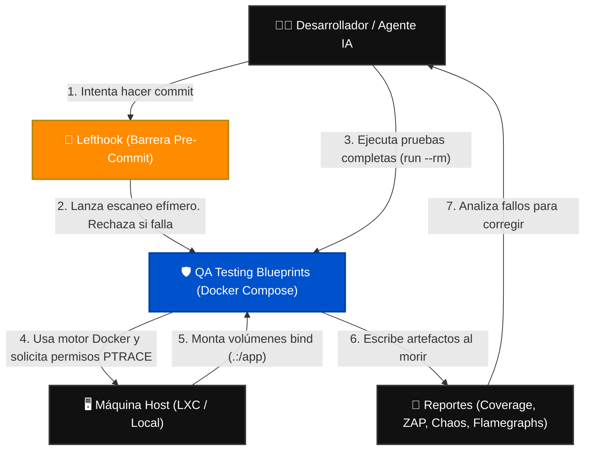
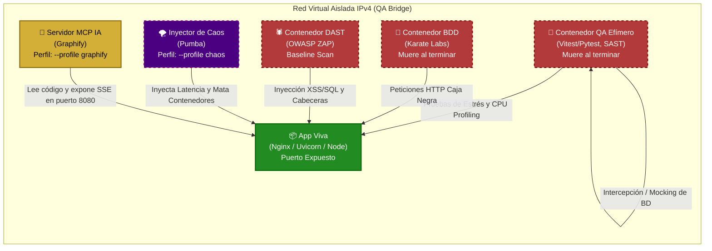
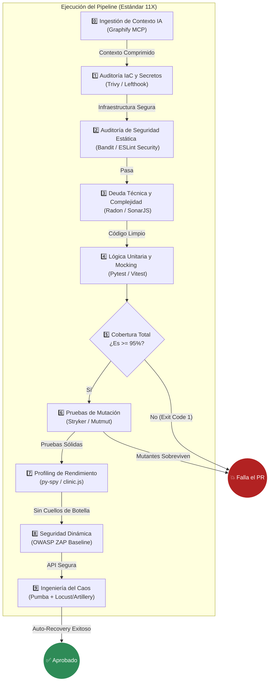

# Arquitectura del Ecosistema de Pruebas (Modelo C4)

Este documento describe gráficamente cómo interactúan las herramientas, contenedores y redes dentro de **QA Testing Blueprints**. Utilizamos una adaptación del Modelo C4 orientada a infraestructura efímera para ilustrar el aislamiento estricto de nuestras pruebas, incluyendo las nuevas capas de Seguridad Dinámica (DAST) e Ingeniería del Caos (Nivel 11X).

---

## Nivel 1: Diagrama de Contexto (System Context)
Muestra el panorama general: cómo los usuarios (o IAs) interactúan con el sistema de pruebas y cómo este se relaciona con la máquina anfitriona.

---

## Nivel 2: Diagrama de Contenedores (Container Diagram)
Muestra el interior del orquestador `docker-compose.qa.yml`. Destaca cómo separamos las responsabilidades en diferentes contenedores que conviven en una red virtual aislada, incluyendo perfiles ocultos para pruebas destructivas e inteligencia artificial.

---

## Nivel 3: Diagrama de Componentes (Component Diagram - Flujo Interno)
Cadena de ejecución innegociable. Si un eslabón falla, el pipeline se aborta (Principio de Fallo Rápido).

---

## Patrones Arquitectónicos Clave

1. **Shift-Left Security:** Obligamos a ejecutar validaciones IaC (Trivy) y SAST (Lefthook) localmente antes de gastar poder de cómputo en CI/CD.
2. **Sidecar / Atacante-Defensor:** Herramientas como ZAP o Locust actúan como atacantes temporales que bombardean a la App Viva. Nunca se instalan dentro de la imagen de producción.
3. **Resiliencia por Caos (Chaos Engineering):** Probar si la API funciona no es suficiente. Usamos Pumba para degradar intencionalmente la red interna (Jitter, Packet Loss) y certificar que la arquitectura no entra en estado de *deadlock*.
4. **Blackbox Network Isolation:** El contenedor BDD (Karate) y el DAST (ZAP) no tienen acceso al código fuente. Se comunican por peticiones TCP/IP puras.
