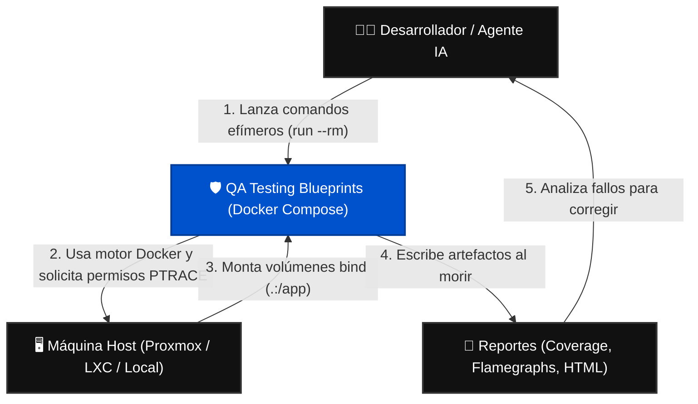
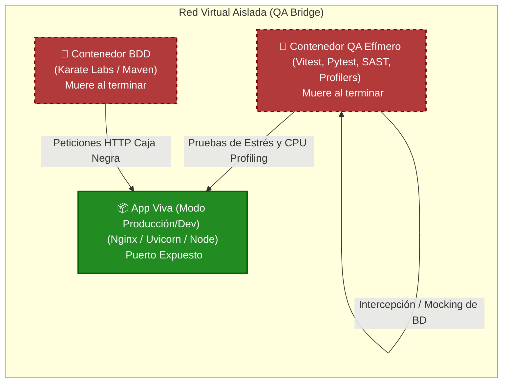
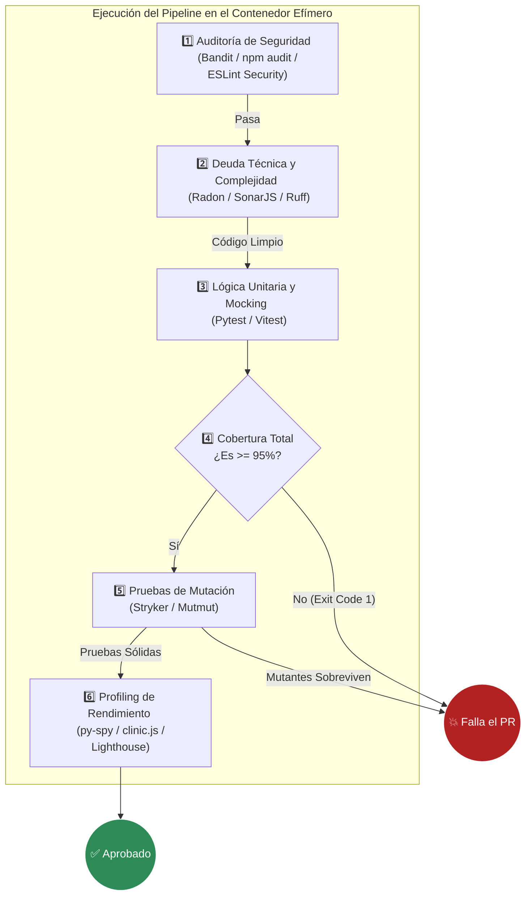

# Arquitectura del Ecosistema de Pruebas (Modelo C4)

Este documento describe gráficamente cómo interactúan las herramientas, contenedores y redes dentro de **QA Testing Blueprints**. Utilizamos una adaptación del Modelo C4 orientada a infraestructura efímera para ilustrar el aislamiento estricto de nuestras pruebas.

---

## Nivel 1: Diagrama de Contexto (System Context)
Muestra el panorama general: cómo los usuarios (o IAs) interactúan con el sistema de pruebas y cómo este se relaciona con la máquina anfitriona.

---

## Nivel 2: Diagrama de Contenedores (Container Diagram)
Muestra el interior del orquestador `docker-compose.qa.yml`. Destaca cómo separamos las responsabilidades en diferentes contenedores que conviven en una red virtual aislada para evitar conflictos de puertos en el host.

---

## Nivel 3: Diagrama de Componentes (Component Diagram - Flujo Interno)
Hacemos un "zoom" dentro del **Contenedor QA Efímero** para entender la cadena de ejecución innegociable. Si un eslabón falla, el pipeline se aborta antes de ejecutar el siguiente (Principio de Fallo Rápido / Fail Fast).

*Nota: Este diagrama representa un ecosistema agnóstico aplicable tanto a Python como a Node/Vue.*

---

## Patrones Arquitectónicos Clave

1. **Sidecar / Atacante-Defensor:** El `Contenedor QA Efímero` actúa como un atacante temporal que bombardea a la `App Viva`. Nunca instalamos herramientas de prueba dentro de la imagen de producción.
2. **Shift-Left Security:** (Nivel 3). Obligamos a ejecutar las validaciones estáticas (SAST y Complejidad) antes de gastar poder de cómputo corriendo pruebas matemáticas o de mutación pesadas.
3. **Blackbox Network Isolation:** El contenedor de BDD (Karate) no tiene acceso al código fuente. Su única forma de comunicarse con la aplicación es a través de peticiones TCP/IP puras en la red aislada, garantizando que el contrato de la API es válido en el mundo real.
